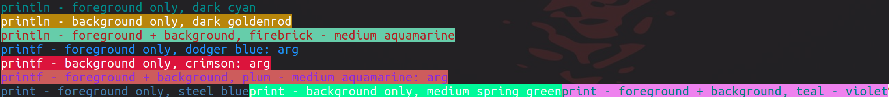
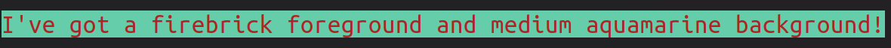

## colorize

Simple library for applying color to terminal output


## Use
```golang
colorizer := colorize.New(colornames.Firebrick, colornames.Mediumaquamarine)
colorizer.Println("I've got a firebrick foreground and medium aquamarine background!")
```


You can get back a color formatted string or byte slice directly as well.
A couple of the major print methods are supported, but open to suggestions
about additional functionality.
